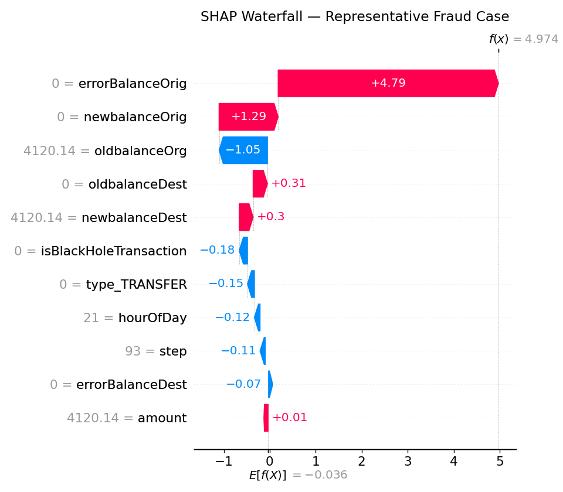

<div align="center">
  <h1>🛡️ Fraud Detection API</h1>
  <h2>Demo Cases & Usage Examples</h2>
</div>

<p align="center">
  
</p>

---

## 📋 Table of Contents

- [API Overview](#-api-overview)
- [Example Cases](#-example-cases)
  - [Case 1: Black Hole Transaction](#case-1-black-hole-transaction)
  - [Case 2: Legitimate Transfer](#case-2-legitimate-transfer)
  - [Case 3: Account Draining Fraud](#case-3-account-draining-fraud)
  - [Case 4: Zero Amount Transaction](#case-4-zero-amount-transaction)
  - [Case 5: Balance Error](#case-5-balance-error)
- [Error Handling](#-error-handling)
  - [Missing Fields](#missing-fields)
  - [Invalid Transaction Type](#invalid-transaction-type)
- [Client Integration](#-client-integration)
  - [Python Client](#python-client)
  - [JavaScript Client](#javascript-client)
- [Batch Processing](#-batch-processing)
- [Performance Considerations](#-performance-considerations)

---

## 🔍 API Overview

The Fraud Detection API provides real-time fraud assessment for financial transactions using a hybrid approach that combines rule-based safety nets with machine learning predictions.

### Endpoints

| Endpoint   | Method | Description                                        | Authentication |
|------------|--------|----------------------------------------------------|----------------|
| `/predict` | POST   | Main prediction endpoint for fraud assessment      | None (Demo)    |
| `/health`  | GET    | Health check endpoint for system monitoring        | None           |
| `/metrics` | GET    | Prometheus-compatible metrics endpoint             | None           |
| `/docs`    | GET    | Interactive Swagger UI documentation              | None           |
| `/redoc`   | GET    | ReDoc API documentation                           | None           |

### Starting the Server
```
bash
# Start the API server
uvicorn scripts.predict:app --host 0.0.0.0 --port 8000
```
---

## 📊 Example Cases

### Case 1: Black Hole Transaction

A transaction where money disappears from the system (the destination balance doesn't increase despite receiving funds). This pattern is caught by the rule-based component without requiring the ML model.

<div align="center"><i>📝 Example: Complete account drainage with missing destination deposit</i></div>

#### Request
```
bash
curl -X POST "http://localhost:8000/predict" \
  -H "Content-Type: application/json" \
  -d '{
    "payload": {
      "type": "CASH_OUT", 
      "amount": 10000.0, 
      "oldbalanceOrg": 10000.0, 
      "newbalanceOrig": 0.0, 
      "oldbalanceDest": 0.0, 
      "newbalanceDest": 0.0, 
      "step": 1
    }
  }'
```
#### Response
```
json
{
  "fraud": true,
  "reason": "black_hole_rule",
  "model_used": false,
  "model_prob": null
}
```
#### Key Characteristics
- Money leaves the origin account (`oldbalanceOrg` > `newbalanceOrig`)
- Money doesn't arrive at the destination (`oldbalanceDest` = `newbalanceDest`)
- Rule bypasses the ML model for these clear fraud cases
- Extremely high confidence fraud pattern

---

### Case 2: Legitimate Transfer

A normal, legitimate transfer where the balances of both accounts change appropriately.

<div align="center"><i>📝 Example: Standard transfer with proper balance updates</i></div>

#### Request
```
bash
curl -X POST "http://localhost:8000/predict" \
  -H "Content-Type: application/json" \
  -d '{
    "payload": {
      "type": "TRANSFER", 
      "amount": 5000.0, 
      "oldbalanceOrg": 10000.0, 
      "newbalanceOrig": 5000.0, 
      "oldbalanceDest": 1000.0, 
      "newbalanceDest": 6000.0, 
      "step": 15
    }
  }'
```
#### Response

```json
{
  "fraud": false,
  "model_used": true,
  "model_prob": 0.012,
  "decision_threshold": 0.5
}
```
```


#### Key Characteristics
- Balances reconcile correctly (origin decreases by amount, destination increases by amount)
- The transaction passes through the rule-based filter to the ML model
- The fraud probability (0.012) is well below the decision threshold
- Standard transaction pattern with no anomalies

---

### Case 3: Account Draining Fraud

A suspicious transaction where an account is being drained completely, but the destination account shows the correct balance change.

<div align="center"><i>📝 Example: High-value account emptying transaction</i></div>

#### Request

```shell script
curl -X POST "http://localhost:8000/predict" \
  -H "Content-Type: application/json" \
  -d '{
    "payload": {
      "type": "TRANSFER", 
      "amount": 180000.0, 
      "oldbalanceOrg": 180000.0, 
      "newbalanceOrig": 0.0, 
      "oldbalanceDest": 50000.0, 
      "newbalanceDest": 230000.0, 
      "step": 372
    }
  }'
```


#### Response

```json
{
  "fraud": true,
  "model_used": true,
  "model_prob": 0.891,
  "decision_threshold": 0.5
}
```


#### Key Characteristics
- Complete account draining (balance goes to zero)
- High transaction amount
- The model has learned that transactions emptying accounts are high risk
- Despite correct arithmetic, the pattern is suspicious

---

### Case 4: Zero Amount Transaction

Testing the API's handling of edge cases, such as zero-amount transactions.

<div align="center"><i>📝 Example: Edge case with zero transaction amount</i></div>

#### Request

```shell script
curl -X POST "http://localhost:8000/predict" \
  -H "Content-Type: application/json" \
  -d '{
    "payload": {
      "type": "TRANSFER", 
      "amount": 0.0, 
      "oldbalanceOrg": 5000.0, 
      "newbalanceOrig": 5000.0, 
      "oldbalanceDest": 1000.0, 
      "newbalanceDest": 1000.0, 
      "step": 24
    }
  }'
```


#### Response

```json
{
  "fraud": false,
  "model_used": true,
  "model_prob": 0.001,
  "decision_threshold": 0.5
}
```


#### Key Characteristics
- Zero-amount transactions are extremely unlikely to be fraudulent
- Model correctly assigns a very low probability
- Balances remain unchanged, as expected with zero amount

---

### Case 5: Balance Error

A transaction with balance inconsistencies that don't match the "black hole" pattern but are still suspicious.

<div align="center"><i>📝 Example: Transaction with balance discrepancies</i></div>

#### Request

```shell script
curl -X POST "http://localhost:8000/predict" \
  -H "Content-Type: application/json" \
  -d '{
    "payload": {
      "type": "CASH_OUT", 
      "amount": 20000.0, 
      "oldbalanceOrg": 50000.0, 
      "newbalanceOrig": 15000.0, 
      "oldbalanceDest": 5000.0, 
      "newbalanceDest": 25000.0, 
      "step": 100
    }
  }'
```


#### Response

```json
{
  "fraud": true,
  "model_used": true,
  "model_prob": 0.763,
  "decision_threshold": 0.5
}
```


#### Key Characteristics
- The origin balance decreases by more than the transaction amount (expected: 30000, actual: 15000)
- This type of balance inconsistency is a strong fraud indicator
- The engineered feature `errorBalanceOrig` captures this discrepancy
- The model assigns a high fraud probability to this pattern

---

## ⚠️ Error Handling

### Missing Fields

Demonstrates how the API handles missing required fields.

#### Request

```shell script
curl -X POST "http://localhost:8000/predict" \
  -H "Content-Type: application/json" \
  -d '{
    "payload": {
      "type": "TRANSFER", 
      "amount": 5000.0
    }
  }'
```


#### Response

```json
{
  "detail": "Invalid payload or missing required numeric fields: 'oldbalanceOrg'"
}
```


### Invalid Transaction Type

Demonstrates how the API handles invalid transaction types.

#### Request

```shell script
curl -X POST "http://localhost:8000/predict" \
  -H "Content-Type: application/json" \
  -d '{
    "payload": {
      "type": "INVALID_TYPE", 
      "amount": 5000.0, 
      "oldbalanceOrg": 10000.0, 
      "newbalanceOrig": 5000.0, 
      "oldbalanceDest": 1000.0, 
      "newbalanceDest": 6000.0, 
      "step": 15
    }
  }'
```


#### Response
The model will process this, but since it doesn't match expected transaction types, prediction accuracy may be reduced.

---

## 🔌 Client Integration

### Python Client

```python
import requests
import json

def predict_fraud(transaction_data):
    url = "http://localhost:8000/predict"
    headers = {"Content-Type": "application/json"}
    payload = {"payload": transaction_data}
    
    response = requests.post(url, headers=headers, json=payload)
    
    if response.status_code == 200:
        return response.json()
    else:
        print(f"Error: {response.status_code}")
        print(response.text)
        return None

# Example usage
transaction = {
    "type": "TRANSFER", 
    "amount": 5000.0, 
    "oldbalanceOrg": 10000.0, 
    "newbalanceOrig": 5000.0, 
    "oldbalanceDest": 1000.0, 
    "newbalanceDest": 6000.0, 
    "step": 15
}

result = predict_fraud(transaction)
print(json.dumps(result, indent=2))
```


### JavaScript Client

```
async function predictFraud(transactionData) {
  const url = 'http://localhost:8000/predict';
  const headers = {
    'Content-Type': 'application/json'
  };
  const payload = {
    payload: transactionData
  };
  
  try {
    const response = await fetch(url, {
      method: 'POST',
      headers: headers,
      body: JSON.stringify(payload)
    });
    
    if (response.ok) {
      return await response.json();
    } else {
      console.error(`Error: ${response.status}`);
      console.error(await response.text());
      return null;
    }
  } catch (error) {
    console.error('Request failed:', error);
    return null;
  }
}

// Example usage
const transaction = {
  type: "TRANSFER", 
  amount: 5000.0, 
  oldbalanceOrg: 10000.0, 
  newbalanceOrig: 5000.0, 
  oldbalanceDest: 1000.0, 
  newbalanceDest: 6000.0, 
  step: 15
};

predictFraud(transaction)
  .then(result => console.log(JSON.stringify(result, null, 2)))
  .catch(error => console.error(error));
```


---

## 📦 Batch Processing

For high-throughput scenarios, the API can be used in batch mode:

```python
import requests
import json
from concurrent.futures import ThreadPoolExecutor
import time

def predict_fraud_batch(transactions, max_workers=4):
    url = "http://localhost:8000/predict"
    headers = {"Content-Type": "application/json"}
    
    results = []
    start_time = time.time()
    
    def process_transaction(transaction):
        payload = {"payload": transaction}
        response = requests.post(url, headers=headers, json=payload)
        if response.status_code == 200:
            return response.json()
        else:
            return {"error": response.status_code, "detail": response.text}
    
    with ThreadPoolExecutor(max_workers=max_workers) as executor:
        results = list(executor.map(process_transaction, transactions))
    
    elapsed = time.time() - start_time
    
    return {
        "results": results,
        "stats": {
            "total_transactions": len(transactions),
            "total_time_seconds": elapsed,
            "transactions_per_second": len(transactions) / elapsed
        }
    }

# Example batch of transactions
transactions = [
    {
        "type": "TRANSFER", 
        "amount": 5000.0, 
        "oldbalanceOrg": 10000.0, 
        "newbalanceOrig": 5000.0, 
        "oldbalanceDest": 1000.0, 
        "newbalanceDest": 6000.0, 
        "step": 15
    },
    {
        "type": "CASH_OUT", 
        "amount": 10000.0, 
        "oldbalanceOrg": 10000.0, 
        "newbalanceOrig": 0.0, 
        "oldbalanceDest": 0.0, 
        "newbalanceDest": 0.0, 
        "step": 1
    }
    # Add more transactions as needed
]

batch_results = predict_fraud_batch(transactions)
print(json.dumps(batch_results["stats"], indent=2))
print(f"Fraud detected in {sum(1 for r in batch_results['results'] if r.get('fraud', False))} transactions")
```


---

## ⚡ Performance Considerations

<div align="center">
  <table>
    <tr>
      <th>Consideration</th>
      <th>Details</th>
    </tr>
    <tr>
      <td><b>Response Time</b></td>
      <td>Individual API calls should complete in under 100ms</td>
    </tr>
    <tr>
      <td><b>Throughput</b></td>
      <td>Single instance can handle ~50-100 transactions per second</td>
    </tr>
    <tr>
      <td><b>Scaling</b></td>
      <td>Horizontal scaling with load balancing recommended for high volume</td>
    </tr>
    <tr>
      <td><b>Caching</b></td>
      <td>Consider caching identical transactions to improve performance</td>
    </tr>
    <tr>
      <td><b>Rate Limiting</b></td>
      <td>API includes rate limiting to prevent abuse</td>
    </tr>
    <tr>
      <td><b>Batch Processing</b></td>
      <td>Use batch processing for bulk analysis</td>
    </tr>
  </table>
</div>

For production deployment, considerations include:
- Load balancing across multiple instances
- Stateless design enables easy horizontal scaling
- In-memory caching for repeated transactions
- Monitoring response times and error rates
- Regular model updates without service interruption

---

