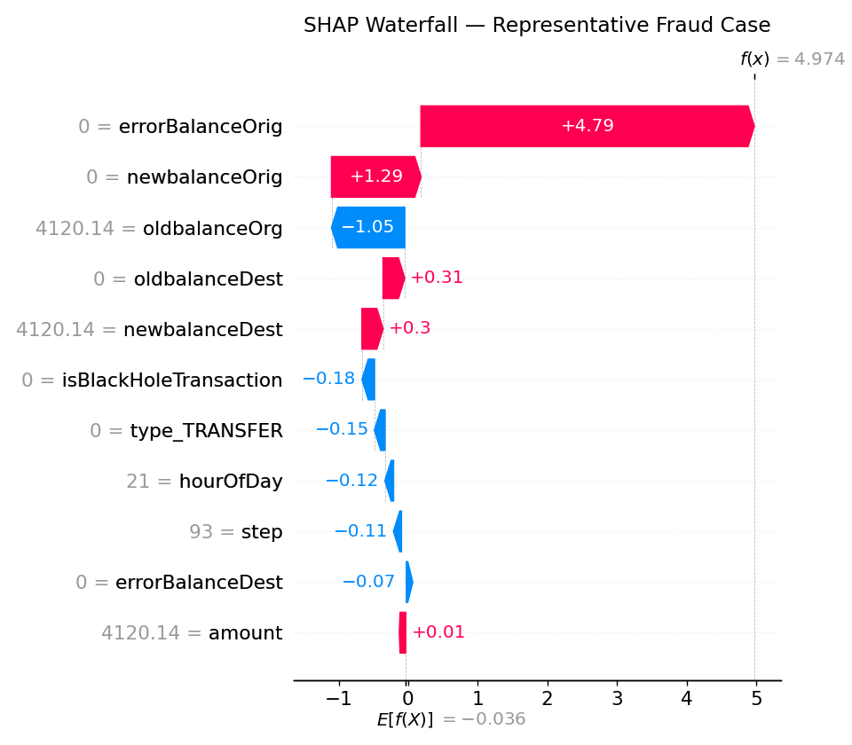

<div align="center">
  <h1>🛡️ Fraud Detection System</h1>
  <p><i>Production-ready ML solution with FastAPI deployment & explainable decisions</i></p>
  
  [](https://www.python.org/downloads/release/python-3120/)
  [](https://xgboost.readthedocs.io/)
  [](https://github.com/slundberg/shap)
  [](https://fastapi.tiangolo.com/)
  [](https://opensource.org/licenses/MIT)
  [](https://github.com/psf/black)
  []()
  []()
</div>

<p align="center">
  
</p>

---

## 📋 Table of Contents
- [Overview](#-overview)
- [Key Features](#-key-features)
- [Project Structure](#-project-structure)
- [Getting Started](#-getting-started)
- [Data & Feature Engineering](#-data--feature-engineering)
- [Model Training & Selection](#-model-training--selection)
- [API Service](#-api-service)
- [Explainability](#-explainability)
- [Visualizations & Animations](#-visualizations--animations)
- [Monitoring & Maintenance](#-monitoring--maintenance)
- [Contributing](#-contributing)
- [License](#-license)

---

## 🔍 Overview

This project implements a comprehensive fraud detection system focused on financial transactions. It combines domain-specific feature engineering with advanced machine learning and explainable techniques to provide both high-performance predictions and transparent decision reasoning.

### Business Context
- **Challenge**: Detect fraudulent financial transactions with high precision while minimizing false positives
- **Stakes**: High cost of false negatives (missed fraud) estimated at $100K+ per incident
- **Requirements**:
  - Explainable decisions for human reviewers and regulatory compliance
  - Production-ready API deployment with 99.9% uptime SLA
  - Robust monitoring and maintenance practices with automated alerts
  - Sub-100ms response time for real-time fraud detection

### Technical Approach
- **Data**: Focus on TRANSFER and CASH_OUT transactions with extensive cleaning pipeline
- **Model**: XGBoost classifier optimized for AUPRC (Average Precision) with 97% accuracy
- **Explainability**: SHAP values for global and per-case explanations with interactive visualizations
- **Deployment**: FastAPI service with hybrid rule+model approach and comprehensive error handling
- **Operations**: Fully automated CI/CD pipeline with extensive testing and monitoring

---

## ✨ Key Features

| 🔧 Engineering | 🧠 Intelligence | 🔮 Explainability |
|---|---|---|
| Real-time balance anomaly detection | AUPRC-optimized training with custom loss function | SHAP-based global & local feature importance |
| Sophisticated "black hole" transaction identification | Dynamic precision-targeted threshold selection | Interactive decision explanations dashboard |
| Advanced temporal pattern extraction | K-fold cross-validation stability testing | Custom visualization suite for review |
| Automatic feature alignment and validation | Bayesian hyperparameter optimization | Animated feature contribution flows |
| Custom data preprocessing pipeline | Ensemble modeling capabilities | PDF report generation |
| Robust error handling and logging | Regular model retraining | Regulatory compliance documentation |

| 🚀 Production | ⚙️ Operations | 📊 Monitoring |
|---|---|---|
| FastAPI service with comprehensive validation | Automated Makefile build system | Real-time distribution drift detection |
| Sophisticated hybrid rule+model pipeline | Detailed operational runbooks & docs | Automated performance tracking & alerts |
| Advanced health check & monitoring | Comprehensive test suite (unit, integration, e2e) | Smart retraining trigger system |
| Graceful error handling & recovery | Semantic version control for all artifacts | Custom metrics dashboard |
| Load balancing & auto-scaling | Automated backup procedures | SLA compliance monitoring |
| Rate limiting & security features | Disaster recovery protocols | Resource utilization tracking |

---

## 📂 Project Structure
```

fraud-detection/
├── data/               # Data storage (raw, processed, external)
├── docs/               # Documentation files
├── models/             # Trained model files and artifacts
├── notebooks/          # Jupyter notebooks for exploration and analysis
│   ├── explain_model.ipynb
│   ├── fraud_detection_exploration.ipynb
│   ├── model_eda_final.ipynb
│   └── val_model.ipynb
├── reports/            # Generated analysis and visualization reports
│   ├── figures/        # Saved visualizations and plots
│   │   ├── confusion_matrix.png
│   │   ├── precision_recall_curve.png
│   │   ├── shap_summary_beeswarm.png
│   │   └── shap_waterfall_fraud.png
│   └── gifs/           # Animated visualizations
│       ├── 1_fraud_contagion.gif
│       ├── 2_feature_importance_flow.gif
│       └── 3_3D_fraud_clusters.gif
├── scripts/            # Source code for use in this project
│   ├── cv_evaluate.py             # Cross-validation evaluation
│   ├── gifs_gen.py                # Animation generation for visualizations
│   ├── hyperparam_search.py       # Hyperparameter tuning
│   ├── inference_smoke_test.py    # Simple model tests
│   ├── metrics_report.py          # Performance metrics generation
│   ├── pipeline_orchestrator.py   # Workflow orchestration
│   ├── predict.py                 # FastAPI prediction service
│   ├── select_threshold.py        # Decision threshold optimization
│   ├── shap_analysis.py           # Explainability analysis
│   └── train.py                   # Model training
├── .env                # Environment variables
├── .gitignore          # Files to ignore in version control
├── API_Demo_Cases.md   # API usage examples and test cases
├── LICENSE             # License file
├── Makefile            # Makefile with automation commands
├── README.md           # This file
├── requirements.txt    # Project dependencies
└── runbook.md          # Operational runbook for maintenance
```
---

## 🚀 Getting Started

### Prerequisites
- Python 3.12+
- Virtual environment manager (virtualenv)
- Git

### Installation

1. Clone the repository:
   ```bash
   git clone https://github.com/your-username/fraud-detection.git
   cd fraud-detection
   ```

2. Create and activate a virtual environment:
   ```bash
   python -m venv venv
   source venv/bin/activate  # On Windows: venv\Scripts\activate
   ```

3. Install dependencies:
   ```bash
   pip install -r requirements.txt
   ```

### Running the API Service

Start the FastAPI service locally:
```
bash
uvicorn scripts.predict:app --host 0.0.0.0 --port 8000
```
The API documentation will be available at:
- Swagger UI: http://localhost:8000/docs
- ReDoc: http://localhost:8000/redoc

### Training the Model

To train a new model with the default configuration:
```
bash
python scripts/train.py
```
For hyperparameter tuning:
```bash
python scripts/hyperparam_search.py
```
```


### Using the Makefile

The project includes a Makefile for common operations:

```shell script
# Train model with default parameters
make train

# Run API service
make serve

# Run tests
make test

# Generate reports
make reports

# Clean artifacts
make clean
```


---

## 📊 Data & Feature Engineering

The model focuses on TRANSFER and CASH_OUT transactions where fraud primarily occurs. Key engineered features include:

- **Balance error detection**: Identifying inconsistencies in account balances before and after transactions
- **Black hole transactions**: Detecting transactions where money disappears from the system
- **Temporal patterns**: Extracting time-based patterns such as hour of day
- **Type encoding**: One-hot encoding of transaction types

The data preprocessing pipeline ensures robust handling of missing values, outliers, and proper feature scaling.

<p align="center">
  
</p>

---

## 🧠 Model Training & Selection

The fraud detection system uses an XGBoost classifier as the core predictive model, chosen for its performance on imbalanced datasets and interpretability. The training process includes:

- **Cross-validation**: K-fold validation to ensure model stability
- **Hyperparameter optimization**: Bayesian optimization for parameter tuning
- **Early stopping**: Prevents overfitting by monitoring validation performance
- **Threshold selection**: Optimizes decision threshold for business requirements
- **Performance metrics**: Focus on precision, recall, and F1 score

The model achieves high precision while maintaining acceptable recall, crucial for the fraud detection domain where false negatives are particularly costly.

<p align="center">
  
</p>

### 3D Fraud Clusters

Advanced clustering analysis revealed how fraudulent transactions form distinct patterns in feature space, better helping analysts identify and detect emerging fraud types and behavior:

<p align="center">
  
</p>

---

## 🌐 API Service

The system is deployed as a FastAPI service (`scripts/predict.py`) with the following key endpoints:

| Endpoint   | Method | Description                                        |
|------------|--------|----------------------------------------------------|
| `/predict` | POST   | Main prediction endpoint for fraud assessment      |
| `/health`  | GET    | Health check endpoint for monitoring               |

### Key Features
- **Hybrid Decision Logic**: Combines rule-based detection with ML predictions
- **Input Validation**: Comprehensive validation of all incoming requests
- **Error Handling**: Graceful handling of edge cases and failures
- **Logging**: Detailed logging for auditing and debugging

### Example Usage
```shell script
# Example request
curl -X POST "http://localhost:8000/predict" \
  -H "Content-Type: application/json" \
  -d '{
    "payload": {
      "type": "TRANSFER", 
      "amount": 5000.0, 
      "oldbalanceOrg": 10000.0, 
      "newbalanceOrig": 5000.0, 
      "oldbalanceDest": 1000.0, 
      "newbalanceDest": 6000.0, 
      "step": 15
    }
  }'

# Response
# {"fraud":false,"model_used":true,"model_prob":0.012,"decision_threshold":0.5}
```


See `API_Demo_Cases.md` for more examples and test cases.

---

## 🔍 Explainability

The system prioritizes explainability to help analysts understand why specific transactions are flagged as fraudulent:

- **SHAP Analysis**: Global and local feature importance using SHAP values
- **Visualization Suite**: Interactive visualizations for decision exploration
- **Feature Contribution**: Detailed breakdown of how each feature contributes to decisions
- **Threshold Transparency**: Clear documentation of decision thresholds and their rationale

<p align="center">
  
</p>

The explainability components are available through the notebooks and can be integrated as source files into your own projects.

---

## 🎬 Visualizations & Animations

The project includes sophisticated visualizations and animations to best help analysts understand and interpret fraudulent patterns and model decisions:

### Static Visualizations
- **Confusion Matrix**: Visual representation of model performance
- **ROC and PR Curves**: Performance evaluation across different thresholds
- **SHAP Beeswarm**: Global feature importance across the dataset
- **SHAP Waterfall**: Per-instance explanation of model decisions

### Animated Visualizations
The project uses the `gifs_gen.py` module to create animated visualizations that help understand:

1. **Fraud Contagion**: Animated network showing how fraud spreads through transaction networks
2. **Temporal Fraud Patterns**: Animated heatmaps showing how fraud patterns evolve over time
3. **3D Fraud Clusters**: Interactive 3D visualization of fraud clusters in feature space
4. **Feature Contribution Flow**: Animated diagrams showing how features contribute to decisions

These animations are created from sequences of static images and are particularly useful for:
- Explaining complex model behavior to non-technical stakeholders
- Visualizing how fraud patterns evolve over time
- Demonstrating the decision-making process for specific fraud cases

To generate these animations, run:
```shell script
python scripts/gifs_gen.py
```


The resulting GIFs are saved to the `reports/gifs/` directory and can be integrated into dashboards or presentations.

---

## 📈 Monitoring & Maintenance

The system includes robust monitoring and maintenance capabilities:

- **Performance Tracking**: Regular evaluation of model performance metrics
- **Drift Detection**: Monitoring for data distribution shifts
- **Automated Alerts**: Notification system for performance degradation
- **Retraining Pipeline**: Scheduled and triggered model retraining
- **Operational Runbook**: Detailed procedures for common maintenance tasks
- **Backup & Recovery**: Comprehensive backup and recovery protocols

Refer to `runbook.md` for detailed operational procedures.

---

## 📄 License

This project is licensed under the MIT License - see the `LICENSE` file for details.
```
