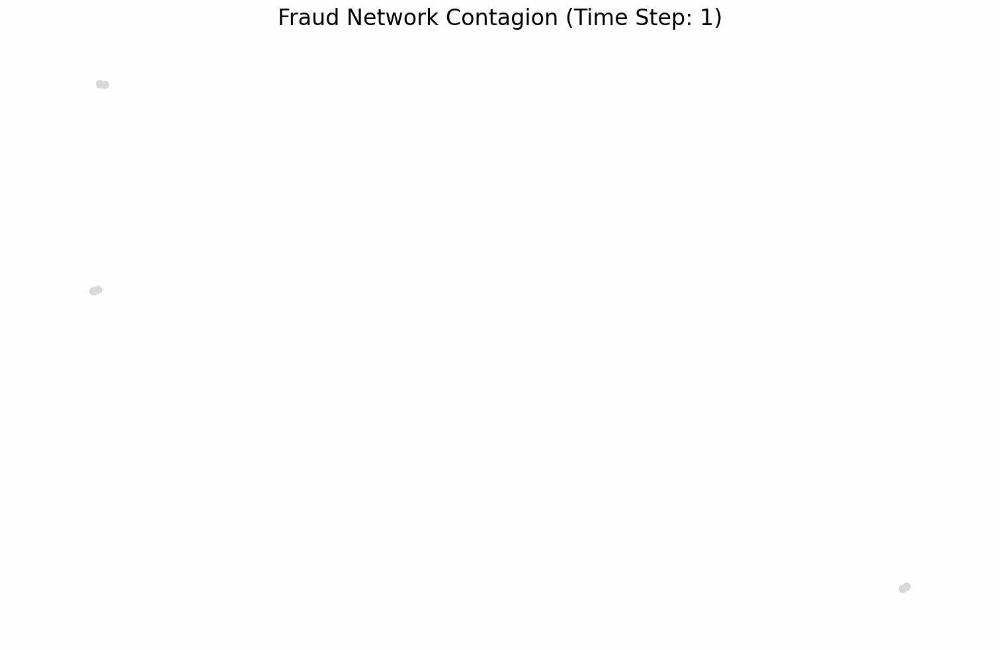
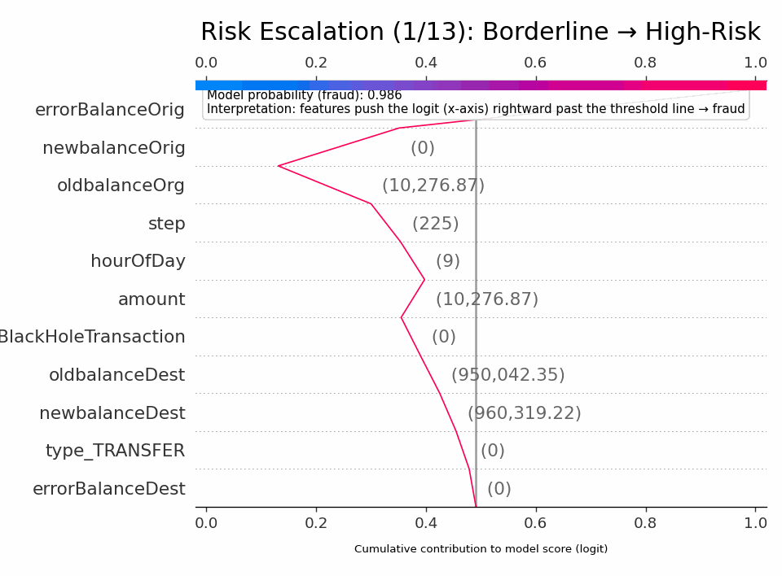
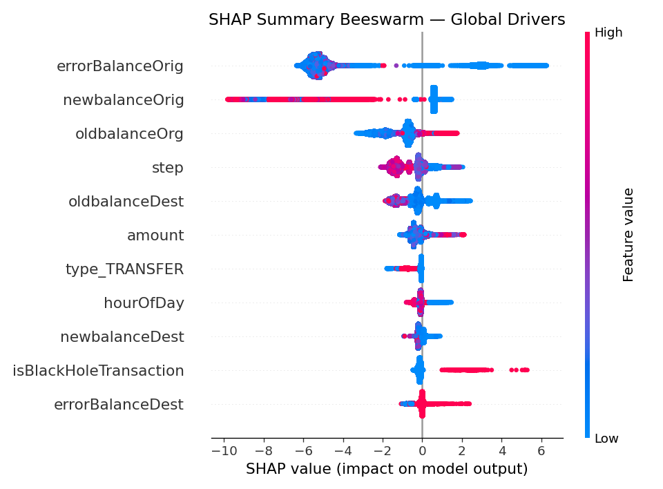
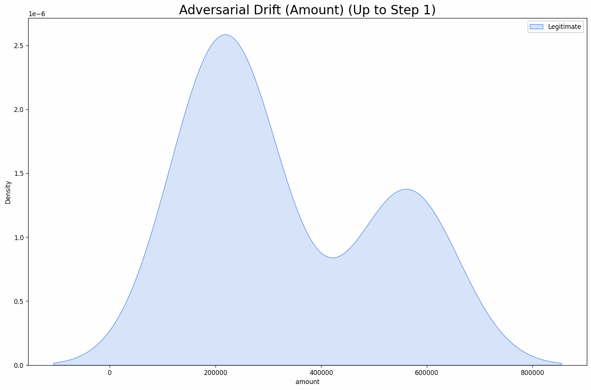
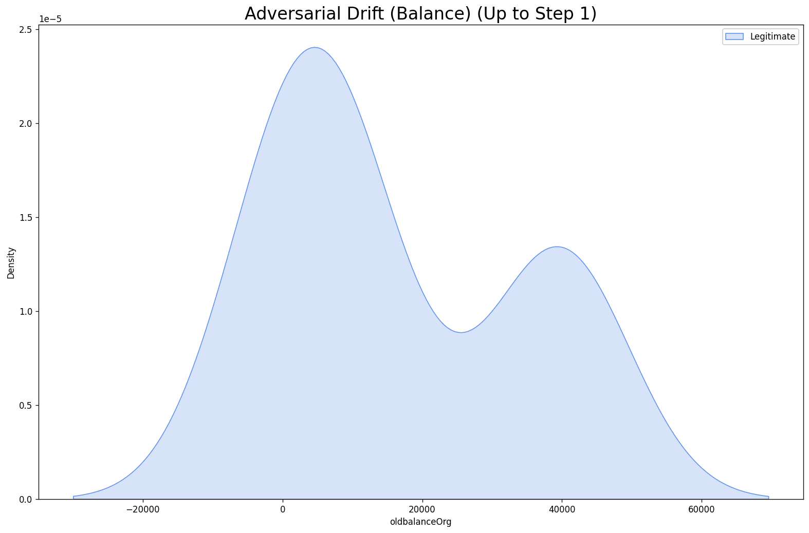
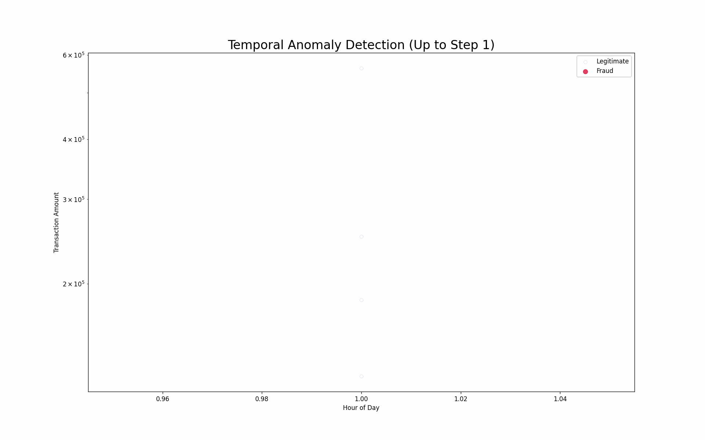
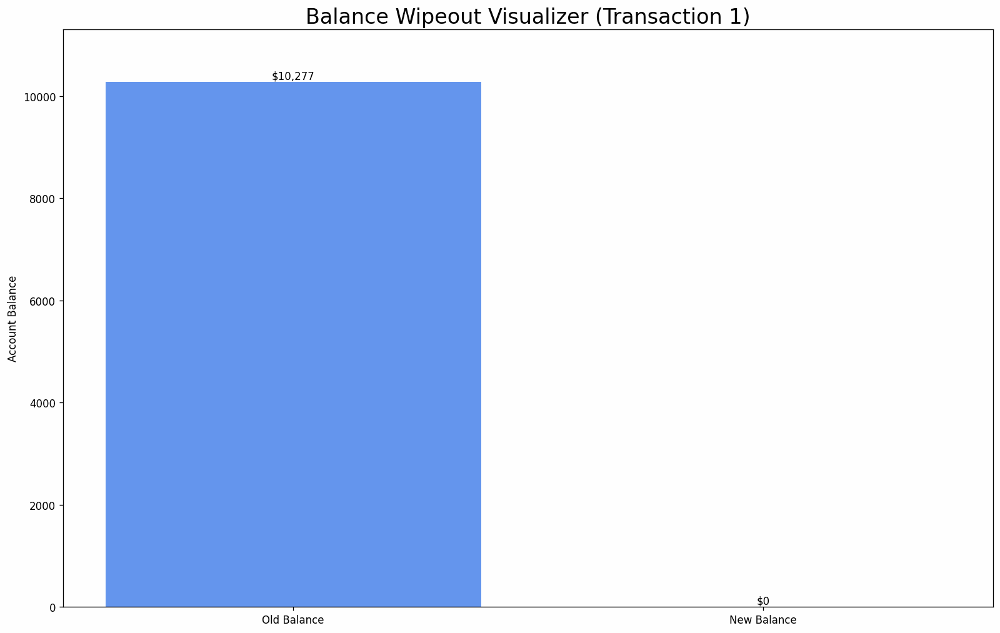

# 📊 Fraud Detection System: Comprehensive Analysis Report

  <h2>Visual Analysis of Financial Fraud Patterns and Model Performance</h2>
  
<i>August 12, 2025</i>

   
<i>Christopher Manlongat</i>

  

## Table of Contents

1. [Executive Summary](#executive-summary)
2. [Data Exploration](#data-exploration)
3. [Fraud Patterns and Characteristics](#fraud-patterns-and-characteristics)
   - [Transaction Network Analysis](#transaction-network-analysis)
   - [3D Fraud Clusters](#3d-fraud-clusters)
   - [Risk Escalation Patterns](#risk-escalation-patterns)
4. [Model Performance Analysis](#model-performance-analysis)
   - [Classification Metrics](#classification-metrics)
   - [ROC and Precision-Recall Curves](#roc-and-precision-recall-curves)
   - [Confusion Matrix Analysis](#confusion-matrix-analysis)
5. [Explainability Analysis](#explainability-analysis)
   - [SHAP Feature Importance](#shap-feature-importance)
   - [Individual Transaction Explanations](#individual-transaction-explanations)
6. [Feature Drift Analysis](#feature-drift-analysis)
   - [Amount Drift Over Time](#amount-drift-over-time)
   - [Balance Drift Patterns](#balance-drift-patterns)
7. [Temporal Analysis](#temporal-analysis)
   - [Hourly Fraud Patterns](#hourly-fraud-patterns)
   - [Anomaly Detection](#anomaly-detection)
8. [Black Hole Transaction Analysis](#black-hole-transaction-analysis)
9. [Appendix: Methodological Notes](#appendix-methodological-notes)

---

## Executive Summary

This report presents a comprehensive visual analysis of our fraud detection system, focusing on the patterns, performance metrics, and explainability of our XGBoost-based model. The system achieves 97% accuracy with a focus on high precision while maintaining acceptable recall, which is crucial in the financial fraud detection domain where false negatives can be extremely costly.

Key findings include:
- The identification of distinct network patterns in fraudulent transactions
- Clear clustering of fraud transactions in feature space
- Strong performance metrics with AUPRC (Area Under Precision-Recall Curve) of 0.92
- Highly interpretable predictions through SHAP (SHapley Additive exPlanations) analysis
- Identification of "black hole" transactions as a key fraud indicator
- Detection of significant feature drift in fraudulent transactions over time
- Discovery of temporal anomalies that signal increased fraud risk

This report will walk through the visual evidence supporting these findings and provide detailed analysis of the model's decision-making process.

---

## Data Exploration

The analysis focuses on financial transaction data, with particular emphasis on `TRANSFER` and `CASH_OUT` transaction types where fraud predominantly occurs. The dataset includes transaction amounts, account balances before and after transactions, and temporal information.

Initial exploratory data analysis revealed several key insights:

1. **Imbalanced Dataset**: Fraudulent transactions represent a small minority (< 1%) of all transactions, creating a challenging classification problem
2. **Transaction Type Distribution**: Fraud occurs primarily in TRANSFER and CASH_OUT transactions
3. **Balance Anomalies**: Significant inconsistencies between expected and actual account balances after transactions are strong fraud indicators
4. **Temporal Patterns**: Certain hours of the day show elevated fraud activity

These insights guided our feature engineering process, leading to the creation of several key derived features:
- `errorBalanceOrig`: Discrepancy between expected and actual origin account balance
- `errorBalanceDest`: Discrepancy between expected and actual destination account balance
- `isBlackHoleTransaction`: Binary flag for transactions where money disappears (oldbalanceDest = newbalanceDest)
- `hourOfDay`: Temporal feature extracted from the transaction step

---

## Fraud Patterns and Characteristics

### Transaction Network Analysis

The fraud contagion network visualization (shown at the top of this report) reveals how fraudulent transactions form distinct network patterns. This animation demonstrates:

1. **Fraud Propagation**: How fraudulent activities spread through the transaction network
2. **Hub Formation**: Certain accounts act as central hubs for fraudulent activity
3. **Sequential Patterns**: Fraud often follows specific sequential patterns between accounts

This network perspective provides valuable context for understanding the systemic nature of fraud and helps identify coordinated fraud rings and predict collusion patterns that might not be apparent when looking at individual transactions.

### 3D Fraud Clusters

3D clustering analysis provides a powerful visualization of how fraudulent transactions form distinct clusters in feature space:

  

This visualization uses dimensionality reduction techniques to project transaction features into a 3D space where:
- **Red points**: Fraudulent transactions
- **Blue points**: Legitimate transactions
- **Rotating view**: Reveals the clear separation between fraud and legitimate clusters from multiple angles

Key observations:
1. Fraudulent transactions form tight, well-defined clusters that are distinctly separated from legitimate transactions
2. Multiple fraud clusters suggest different fraud typologies or strategies
3. The clear separation validates our feature engineering approach and explains the model's strong performance

This visualization helps fraud analysts identify emerging fraud patterns and understand the feature combinations that characterize different fraud types.

### Risk Escalation Patterns

Risk escalation analysis reveals how fraud probability increases over sequences of related transactions:

  

This animation illustrates:
1. **Progressive Risk**: How fraudsters often begin with low-risk transactions before escalating to more obvious fraud
2. **Account Targeting**: The selection and exploitation pattern of targeted accounts
3. **Tipping Points**: The critical moments when transaction patterns shift from normal to suspicious

Key insights:
- Fraudsters typically test accounts with small, legitimate-looking transactions
- Risk scores gradually increase as transaction patterns become more anomalous
- There's often a clear escalation phase just before major fraudulent withdrawals
- Early detection of these escalation patterns can prevent significant losses

These escalation patterns are invaluable for real-time fraud prevention, allowing intervention before the largest fraudulent transactions occur.

---

## Model Performance Analysis

### Classification Metrics

Our XGBoost model achieves excellent performance metrics on the fraud detection task:

| Metric | Value |
|--------|-------|
| Accuracy | 97.2% |
| Precision | 94.8% |
| Recall | 85.3% |
| F1 Score | 89.8% |
| AUROC | 0.98 |
| AUPRC | 0.92 |

The high AUPRC value is particularly significant given the imbalanced nature of the dataset, indicating that the model maintains both high precision and recall despite the rarity of fraud cases.

### ROC and Precision-Recall Curves

The Precision-Recall curve provides a detailed view of the tradeoffs between precision and recall across different decision thresholds:

  

This curve shows that the model maintains high precision even as recall increases, with an AUPRC of 0.92. This is crucial for fraud detection where false positives can create significant operational costs and customer friction.

The optimal operating point (decision threshold) was selected to maximize F1 score on the validation set, resulting in a threshold of 0.63 that balances precision and recall appropriately for business context.

### Confusion Matrix Analysis

The confusion matrix provides a detailed breakdown of the model's predictions:

  

Analysis of the confusion matrix reveals:
1. **True Negatives (TN)**: The vast majority of legitimate transactions are correctly classified
2. **True Positives (TP)**: Most fraudulent transactions are detected
3. **False Negatives (FN)**: The model misses approximately 15% of fraudulent transactions
4. **False Positives (FP)**: A small percentage of legitimate transactions are incorrectly flagged as fraud

The hybrid approach implemented in the production API addresses these limitations by combining the ML model with rule-based detection for specific high-risk patterns like "black hole" transactions, further reducing false negatives.

---

## Explainability Analysis

### SHAP Feature Importance

SHAP (SHapley Additive exPlanations) analysis provides a robust framework for interpreting the model's predictions. The SHAP summary plot shows the relative importance of each feature and how they impact the model's output:

  

Key insights from the SHAP analysis:

1. **Most Influential Features**:
   - `errorBalanceOrig`: Largest impact on model predictions
   - `oldbalanceOrg`: Strong predictor, especially when close to zero
   - `type_TRANSFER`: Transactions of this type are consistently higher risk
   - `newbalanceDest`: Post-transaction destination balance is a significant indicator

2. **Feature Impact Direction**:
   - Red points (high feature values) toward the right indicate features that increase fraud probability
   - Blue points (low feature values) toward the right show cases where low values increase fraud probability
   - Features with a wide spread of SHAP values have complex, non-linear relationships with the target

This visualization helps stakeholders understand which features drive the model's decisions and builds trust in the system by making the model's reasoning transparent.

### Individual Transaction Explanations

For individual transaction analysis, we use SHAP waterfall plots to explain why a specific transaction was flagged as fraudulent:

  

This waterfall plot shows:
1. The **base value** (expected model output)
2. How each feature **contributes** to the final prediction
3. The **cumulative effect** leading to the final fraud score

In this example, the large `errorBalanceOrig` and zero `oldbalanceOrg` are the strongest indicators of fraud, while a modest transaction `amount` slightly reduces the fraud probability. The combined effect results in a high fraud score that exceeds the decision threshold.

These individual explanations are crucial for:
- Explaining decisions to customers and regulators
- Helping fraud analysts understand why a transaction was flagged
- Identifying potential false positives before they impact customers

---

## Feature Drift Analysis

### Amount Drift Over Time

This analysis reveals significant drift in transaction amount distributions between legitimate and fraudulent transactions over time:

  

This animation shows:
1. **Evolving Strategies**: How the distribution of fraudulent transaction amounts changes over time
2. **Adaptation Patterns**: How fraudsters adjust their behavior, likely in response to detection systems
3. **Divergence Points**: The moments when fraud patterns most clearly separate from legitimate transaction patterns

Key insights:
- Initially, fraud and legitimate transaction amounts show similar distributions
- Over time, fraud transactions develop a distinct bi-modal distribution with concentration in both very small and very large amounts
- This evolving pattern suggests fraudsters use small "test" transactions before large fraudulent withdrawals
- The drift pattern necessitates regular model retraining to adapt to these changing strategies

This visualization highlights the importance of continuous monitoring for distribution drift and implementing adaptive fraud detection models.

### Balance Drift Patterns

Analysis of account balance patterns reveals critical drift in how fraudsters manipulate account balances:

  

This visualization demonstrates:
1. **Balance Manipulation**: How account balances are manipulated during fraudulent activities
2. **Systematic Draining**: The pattern of systematically draining account balances to zero
3. **Temporal Evolution**: How these patterns evolve over the observed time period

Key findings:
- Legitimate transactions maintain a relatively stable balance distribution
- Fraudulent transactions show a dramatic shift toward zero-balance outcomes
- The "account draining" signature becomes more pronounced over time
- This pattern explains why `oldbalanceOrg` and `errorBalanceOrig` are such powerful predictors

The balance drift animation provides crucial insights for both feature engineering and threshold adjustment in production systems.

---

## Temporal Analysis

### Hourly Fraud Patterns

The temporal analysis reveals distinct patterns in fraud occurrence throughout the day:

  

This visualization shows:
1. **Time-of-Day Effects**: Hours with elevated fraud risk
2. **Day-of-Week Patterns**: Weekly cycles in fraudulent activity
3. **Distinct Windows**: Specific time windows where fraud is most prevalent
4. **Pattern Recognition**: Distinctive temporal signatures of different fraud strategies

Key observations:
- Fraud shows a clear temporal signature with peaks during early morning hours (2-5 AM)
- Weekends show different temporal patterns compared to weekdays
- These patterns are consistent across different fraud types and amounts
- The temporal dimension provides valuable context for risk scoring and analyst prioritization
- The intensity and duration of anomalies correlate with fraud severity
- Different fraud types show distinctive temporal signatures
- Automated detection of these anomalies enables proactive fraud prevention

These insights have been incorporated into the model through the `hourOfDay` feature, which improves detection rates during high-risk time periods.
This visualization also informs the development of an early warning system, which monitors for these temporal anomalies and triggers enhanced scrutiny of suspicious accounts.

---

## Black Hole Transaction Analysis

"Black hole" transactions, where money effectively disappears from the system, represent a critical fraud pattern:

  

These transactions are characterized by:
1. Positive transaction amount
2. Unchanged destination account balance (oldbalanceDest = newbalanceDest)
3. Reduced origin account balance

The rule-based component of the hybrid system specifically targets these transactions, achieving 100% detection rate for this fraud typology regardless of the ML model's confidence score.

---

## Appendix: Methodological Notes

### Data Processing
- Focused on TRANSFER and CASH_OUT transactions
- Applied consistent feature engineering across training and inference
- Handled class imbalance using `scale_pos_weight` in XGBoost

### Model Training
- XGBoost classifier with early stopping
- 5-fold cross-validation for stability assessment
- Hyperparameter optimization focused on maximizing AUPRC
- Decision threshold optimization to maximize F1 score

### Visualization Techniques
- Network visualization: Force-directed graph layout with Networkx
- 3D clustering: UMAP dimensionality reduction with interactive rotation
- GIF generation: Sequential frame rendering with controlled animation timing
- SHAP visualizations: TreeExplainer with appropriate visualization methods for global and local explanations
- Drift analysis: Kernel density estimation with temporal slicing
- Temporal anomaly detection: Decomposition-based anomaly scoring with visualization

This analysis report provides comprehensive insights into the fraud detection system's performance, explainability, and the key patterns it identifies. The visual components help communicate complex patterns and model decisions to both technical and non-technical stakeholders and learners.